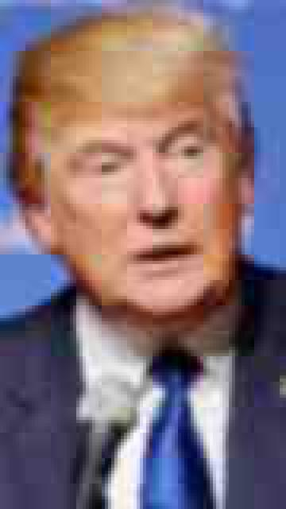
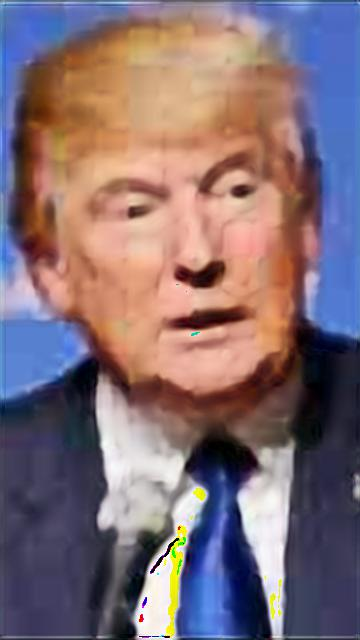
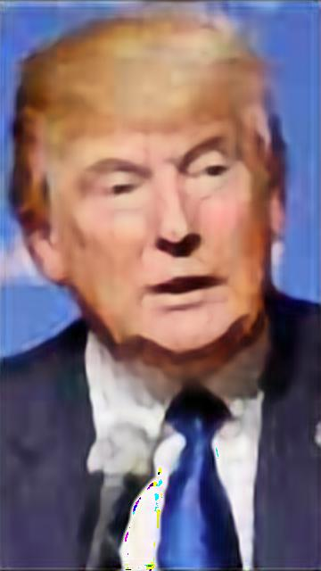
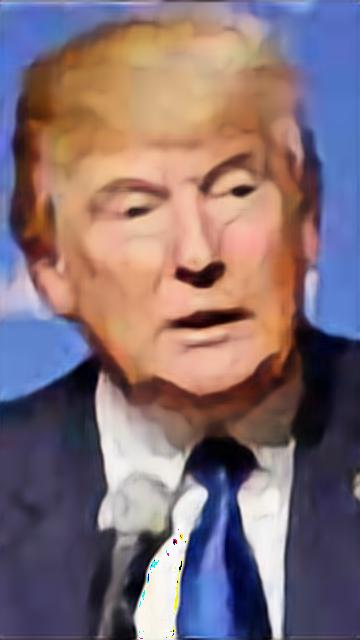
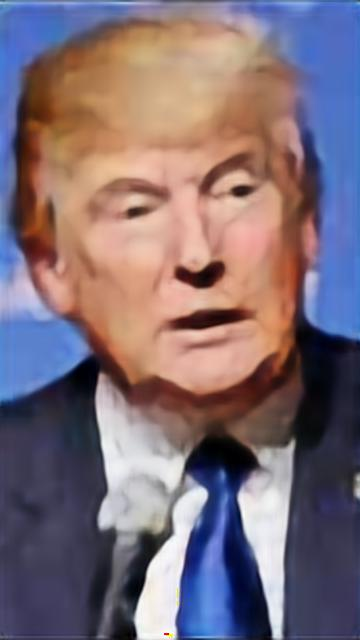

## neura

###### yet another comparison of neural net archs for image enhancement task

#### SOLUTION COMPARISON

_source image_

_interpolation nearest neighbor [see](source/models/interpolation_nearest.py)_

_interpolation bilenear [see](source/models/interpolation_bilenear.py)_

_interpolation bicubic [see](source/models/interpolation_bicubic.py)_

_interpolation lancoz [see](source/models/interpolation_lancoz.py)_

_prescaled convolution net [see](source/models/convolution_scaled.py)_

_upsampling convolution net [see](source/models/convolution.py)_

_upsampling convolution net with avg layers [see](source/models/convolution_avg.py)_

_upsampling convolution net with denoise layers [see](source/models/convolution_denoise.py)_

_upsampling convolution net with rec layers [see](source/models/convolution_rec.py)_

#### TECHNOLOGIES

neura was built with:

-   python3
-   keras
-   pyplot

##### UNMAINTAINED

#### LICENSE

neura is [MIT licensed](LICENSE)
